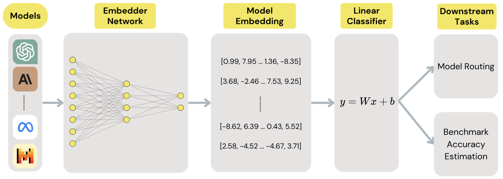

# EmbedLLM: Learning Compact Representations of Large Language Models
This repository contains the official implementation of our [paper](https://arxiv.org/abs/2410.02223): 

**EmbedLLM: Learning Compact Representations of Large Language Models (ICLR 2025 Spotlight)**

By [Richard Zhuang](https://richardzhuang0412.github.io/), 
[Tianhao Wu](https://thwu1.github.io/tianhaowu/),
[Zhaojin Wen](https://www.linkedin.com/in/zhaojin-wen-7657bb220/),
[Andrew Li](https://www.linkedin.com/in/andrewli2403/),
[Jiantao Jiao](https://people.eecs.berkeley.edu/~jiantao),
and [Kannan Ramchandran](https://people.eecs.berkeley.edu/~kannanr/)

<div align="center">
  
  <p><em>An illustration of the EmbedLLM pipeline. An embedder network is pretrained from sample question-answer pairs from a pool of LLMs to map them into vector embeddings. Downstream applications like model routing are adapted by training an additional linear layer on top of these embeddings.</em></p>
</div>

## Installation

1. Clone this repository:
```bash
git clone https://github.com/yourusername/EmbedLLM.git
cd EmbedLLM
```

2. Create and activate the conda environment: 
(Remember to change the prefix path in the environment.yml file to the path of your conda environment)
```bash
conda env create -f environment.yml
conda activate embedllm
```

## Dataset

The dataset used in our experiments is available on HuggingFace:
https://huggingface.co/datasets/RZ412/EmbedLLM

We prepare a script to download some of the correctness data we used to train our model:
```bash
cd data_preprocessing
python download_data.py
```

For full dataset (including training set with various sizes and trained model embeddings), please refer to the above HuggingFace page.

To transform the benchmark questions into embeddings:
```bash
cd data_preprocessing
python get_question_embedding_tensor.py
```

## Usage

### KNN Model

To train a KNN model and evaluate its performance on correctness forecasting:
```bash
cd algorithm
python knn.py
```

Key arguments:
- `--input-format`: Choose between 'tensor' or 'csv' input format (default: 'csv')
- `--num-neighbors`: Number of neighbors for KNN (default: 131)
- `--save-tensors`: Save processed CSV data as tensors for faster future loading

### Matrix Factorization Model

To train our Matrix Factorization model and evaluate its performance:
```bash
cd algorithm
python mf.py
```

Key arguments:
- `--embedding-dim`: Dimension of model embeddings (default: 232)
- `--alpha`: Noise level for regularization (default: 0.05)
- `--batch-size`: Training batch size (default: 2048)
- `--num-epochs`: Number of training epochs (default: 50)
- `--eval-mode`: Evaluation mode - 'correctness' or 'router' (default: 'correctness')

## Citation

If you find this code useful for your research, please cite our paper:

```bibtex
@inproceedings{
zhuang2025embedllm,
title={Embed{LLM}: Learning Compact Representations of Large Language Models},
author={Richard Zhuang and Tianhao Wu and Zhaojin Wen and Andrew Li and Jiantao Jiao and Kannan Ramchandran},
booktitle={The Thirteenth International Conference on Learning Representations},
year={2025},
url={https://openreview.net/forum?id=Fs9EabmQrJ}
}
```
